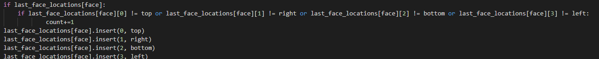

# ScanSpect | Diario di lavoro
##### André Da Silva, Alessandro Aloise, Nathan luè
### Centro Professionale Trevano, 14.02.2020

## Lavori svolti


|Orario        |Lavoro svolto                           |
|--------------|----------------------------------------|
|08:20 - 08:30 | Riunione per organizzare la giornata   |			                                        
|08:30 - 11:35 |<b>André</b>: Ricerca codice esempio per riconoscimento facce<br><b>Nathan & Alessandro</b>: Ricerca Webcam e  consultazione   |
|13:15 - 16:30 | <b>André</b>: Installazione python + librerie su Ubuntu + aiuto al test sul codice face_detect.py <br>    			  <b>Nathan</b>: Lavorato su face_detect.py <br><b>Alessandro</b>: Aiuto installazione python + aiuto al test sul codice face_detect.py |
|16:20 - 16:30 | <b>Alessandro</b>: Stesura diario |

##  Problemi riscontrati e soluzioni adottate
#### Lista dei problemi riscontrati:

1. Delay della web con codice del creatore della libreria:  [ Codice creatore  ](https://github.com/ageitgey/face_recognition)

2. Il contatore delle persone non funziona in modo corretto perché conta il nummero di persone per frame.
<br></br>

<br></br>
Output:
<br></br>


3.	Problemi con gli array multidimensionali dinamici su python. Più precisamente l'aggiunta di nuove righe.

#### Soluzioni

1. Abbiamo cambiato codice di base e questo ci ha permesso di avere meno delay con la webcam ed un incremento dell'range sulla distanza.[ Codice ](https://www.analyticsvidhya.com/blog/2018/12/introduction-face-detection-video-deep-learning-python/)

2. Soluzioni applicabili per il contatore:
	- Soluzione con formula matematica.
	- Assegnazione di un colore per ogni persona.
	- Cercare una libreria che lo faccia già.


3.  Per aggiungere nuove righe ad un array multidimensionale è stato usato il seguente comando: ```array.append([])```.

##  Punto della situazione rispetto alla pianificazione

Siamo allo stesso punto della pianificazione.

## Programma di massima per la prossima giornata di lavoro

Lavoro su codice + messa a punto della virtual.
