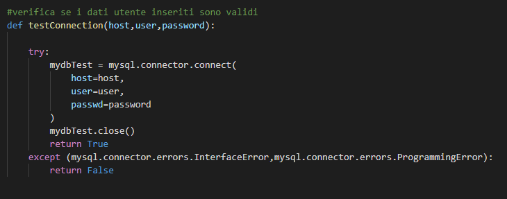

# ScanSpect | Diario di lavoro
##### André Da Silva, Alessandro Aloise, Nathan Luè
### Centro Professionale Trevano, 01.05.2020

## Lavori svolti

|Orario        |Lavoro svolto                           |
|--------------|----------------------------------------|
|10:35 - 17:30 | <b>Nathan</b>: Creazione pagina dati per admin + logica login user   <b>André</b>: Implementazione interfaccia grafica lato client + commenti nel codice <b>Alessandro:</b> Creazione sito informativo   |

##  Problemi riscontrati e soluzioni adottate

- Nel client, ci sono stati dei problemi su come verificare che l'utente inserisca
  dei dati di acesso a MySQL esistenti, tutto ciò senza poter utilizzare le funzioni MySQL della classe mysql.connect dato che ovviamente senza connettersi, non è possibile utilizzare la funzione execute per poter fare delle query e quindi che l'utente esista. Per risolvere il tutto, sono stati gestiti gli errori ProgrammingError (in caso l'utente non esista) e InterfaceError (in caso l'host inserito non esista) tramite try e catch.

  

##  Punto della situazione rispetto alla pianificazione

- Un po' indietro, nella documentazione manca ancora tutta la parte di implementazione.
- Nella struttura manca ancora tutta la parte dei grafici.

## Programma di massima per la prossima giornata di lavoro

- Finire l'interfaccia WEB (grafici).
- Continuazione e miglioramento della documentazione.
