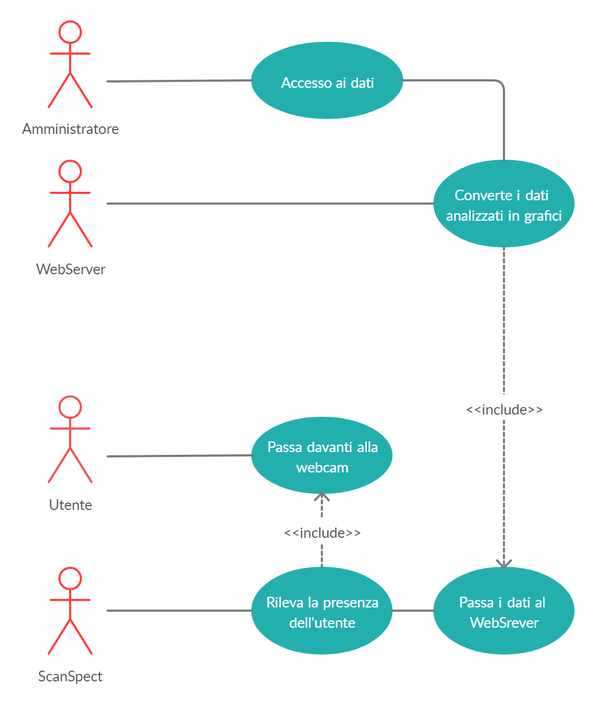

1. [Introduzione](#introduzione)

  - [Informazioni sul progetto](#informazioni-sul-progetto)

  - [Abstract](#abstract)

  - [Scopo](#scopo)

1. [Analisi](#analisi)

  - [Analisi del dominio](#analisi-del-dominio)

  - [Analisi dei mezzi](#analisi-dei-mezzi)

  - [Analisi e specifica dei requisiti](#analisi-e-specifica-dei-requisiti)

  - [Use case](#use-case)

  - [Pianificazione](#pianificazione)

1. [Progettazione](#progettazione)

  - [Design dell’architettura del sistema](#design-dell’architettura-del-sistema)

1. [Implementazione](#implementazione)

1. [Test](#test)

  - [Protocollo di test](#protocollo-di-test)

  - [Risultati test](#risultati-test)

  - [Mancanze/limitazioni conosciute](#mancanze/limitazioni-conosciute)

1. [Consuntivo](#consuntivo)

1. [Conclusioni](#conclusioni)

  - [Sviluppi futuri](#sviluppi-futuri)

  - [Considerazioni personali](#considerazioni-personali)

1. [Sitografia](#sitografia)

1. [Allegati](#allegati)


## Introduzione

### Informazioni sul progetto

  -   Allievi: Nathan Luè, André Da Silva, Alessandro Aloise

  -   Docenti coinvolti: Luca Muggiasca, Geo Petrini

  -   Modulo 306, SAM Trevano I3AC  

  -   Durata progetto: 17 gennaio 2020 - 08 maggio 2020

### Abstract

  Al giorno d'oggi è molto importante avere dei dati che permettono di capire quanto una cosa sia piaciuta alle persone che l'hanno vista. Questo progetto permette di avere un riscontro esaustivo sulla presenza delle persone ad uno stand. Grazie a grafici e dati precisi, il programma, permetterà di sapere quante persone hanno visitato lo stand, in che ora, qual è la fascia oraria con più visite e molto altro. Con questo semplice progetto non è più necessario utilizzare complicati ed obsoleti metodi, grazie a ScanSpect i dati sono nelle tue mani.

  >*Nowadays it is very important to have data that allow you to understand how much a person liked it. This project allows you to have an exhaustive feedback on the presence of people at a stand. Thanks to precise graphics and data, the program will allow you to know how many people visited the stand, at what time, what is the time slot with the most visits and much more. With this simple project it is no longer necessary to use complicated and obsolete methods, thanks to ScanSpect the data are in your hands.*

### Scopo

  Lo scopo di questo progetto didattico è quello di creare un sistema di monitoraggio del numero di persone che si presentano ad un ipotetico stand di una fiera. Il conteggio delle persone avviene tramite l'identificazione delle facce dei soggetti. Se la faccia identificata si muove rimanendo nella webcam viene contata solo una volta. Inoltre vi è la possibilità di visualizzare i dati del conteggio con diversi grafici.


## Analisi

### Analisi e specifica dei requisiti


  Questa è la lista di requisiti discussi in classe con il profesore:

  |**ID**|**Nome**|**Descrizione**|**Priorità**|**Vers**|**Note**|
  |----|------------|--------|----|----------|------|
  |Req-01|Utilizzo di librerie esterne|Devono essere utilizzate delle librerie esterne per poter contare le facce delle persone.|1|1.0|...|
  |Req-02|Multipiattaforma|L'applicativo o il sito deve essere utilizzabile su qualsiasi piattaforma (Windows, Linux e MacOS).|1|1.0|...|
  |Req-03|Registrazione orario di visita|Deve essere registrato l'orario di visita di ogni persona che viene rilevata dalla webcam.|1|1.0|...|
  |Req-04|Salvataggio viso dell'utente non necessario|Non è necessario salvare il viso dell'utente, basta identificare una faccia generica.|1|1.0|...|
  |Req-05|Sito informativo|Deve essere presente un sito informativo consultabile da un utilizzatore del programma. Nel sito è presente una guida e la possibilità di scaricare il software.|1|1.0|...|
  |Req-06|Sezione accessibile all'amministratore|Deve essere presente una sezione accessibile solamente all'amministratore nella quale potrà accedere ai dati registrati ed alle configurazioni del sistema.|1|1.0|...|
  |Req-07|Conteggio persone| Se l'utente si move all'interno del campo della webcam, viene contato solo una volta.|1|1.0|...|
  |Req-08|Conteggio facce|Devono essere contati il numero di persone tramite la loro faccia (se è presente solo il busto o una parte di una persona, il contatore non aumenta).|1|1.0|...|
  |Req-09|Grafici ed analisi|Devono essere presenti dei grafici per analizzare i dati ricavati dalla webcam.|1|1.0|...|
  |Req-10|Riproduzione webcam a schermo|Il video della webcam e i dati analizzati dalla webcam devono essere riprodotti a schermo.|1|1.0|...|
  |Req-11|Presenza di interfaccia|Deve essere presente una Gui.|1|1.0|...|
  |Req-12|Composizione delle statistiche analizzate|Le statistiche dovranno visualizzare nel tempo la frequenza di passaggio allo stand, sia giornalmente che in determinate fasce orarie.|1|1.0|...|


**Spiegazione elementi tabella dei requisiti:**

**ID**: identificativo univoco del requisito

**Nome**: il nome del requisito

**Descrizione**: breve descrizione del requisitol

**Priorità**: l'importanza con la quale deve essere svolto un requisito

**Versione**: indica la versione del requisito.

**Note**: eventuali osservazioni


### Use case




La base della nostra progettazione questo é il diagramma. Il suo scopo è rappresentare in forma schematica le schermate e pulsanti disponibili. La prima "pagina" che appare avviando l'eseguibile é quella del login una volta fatto il login parte direttamente l'applicazione che conta la persone e scrivere sul databse.


### Pianificazione

L'immagine indica il gantt stilato ad inizio progetto. Le due fasi che sulla carta impiegano più tempo sono l'implementazione e il test. Queste fasi sono  circa i 2/3 del tempo impiegato per portare a termine il progetto. Le attività sono divise per allievo, ogni tanto è possibile che più allievi lavorino insieme ed ogni tanto è possibile che un allievo lavori singolarmente. Questo è il gantt iniziale, potrebbe essere differente dal gantt consuntivo indicato nell'immagine sotto.


### Analisi dei mezzi

Per realizzare questo progetto sono stati utilizzati i seguenti software:
<ul>
  <li>ProjectLibre - 1.9.1: Per la creazione del Gantt.</li>
  <li>Visual Studio Code - 1.43: Per tutto ciò che riguarda la scrittura del codice Python/Php/html/css/Javascript</li>
  <li>Python - 2.7: Per la creazione dell'applicativo principale</li>
  <li>OpenCV - 4.2.0: Libreria utilizzata per il riconoscimento facciale</li>
  <li>Tkinter: Libreria per la creazione di interfacce grafiche in Python</li>
  <li>Chart js: Libreria utilizzata per la creazione dei grafici</li>
  <li>Bootstrap (maxdn): "Libreria" css utilizzata per abbellire i grafici</li>
  <li>MySQL Workbench: Per creare e contenere il database</li>
</ul>

L'applicativo è multipiattaforma (Windows, MacOS, Linux). Il progetto non necessa forze computazionali esagerate, necessita però di una WebCam (che sia integrata o esterna). Senza una WebCam l'applicativo non funzionerà.

## Progettazione

Questo capitolo descrive esaustivamente come deve essere realizzato il
prodotto fin nei suoi dettagli. Una buona progettazione permette
all’esecutore di evitare fraintendimenti e imprecisioni
nell’implementazione del prodotto.

### Design dell’architettura del sistema


L'immagine mostra lo schema della struttura del progetto. Il progetto è composto da un programma che rileva il numero di persone. Ad ogni rilevamento inserisce un dato all'interno del database (all'inizio lo crea se non esiste). La logica del sito (in php), si occupa di richiedere i dati al database e di mandarli al sito vero e prorpio. Così facendo il sito ha abbastanza valori per creare un'interfaccia con dei grafici esaustivi e stampare i dati in una tabella.
### Schema logico e descrizione.

Nome database: <b>ScanSpect</b>

people(<u>id</u>,date,hours,minutes,seconds)<br>
Tabella in cui vengono salvate tutte le persone rilevate tramite id (chiave) e a quale data, minuto e secondo.

user(<u>username</u>,password,admin)<br>
Tabella in cui vengono salvati gli utenti registrati nel sito locale con username come chiave, password e
un flag ad indicare se l'utente è admin o no.

### Design delle interfacce


La prima Interfaccia che abbiamo definito é stata quella che vedeva l'utente "normale" vede.


Questa progettazione di interfaccia rappresenta l'avvio del programma con i vari campi da inserire.


Questa é la progettazione della home del sito per vedere i grafici


Questa é la nostra progettazione del login per il sito dove visitare i grafici.


Questa é la nostro progettazione per potersi registrare come utente sul nostro sito.


Questa é la schermata dove gli admin possono dare i privilegi agli altri utenti.

### Design procedurale


## Implementazione

<h4>Applicazione Client</h4>

Il client si occupa di eseguire la detection di tutti volti trovati dalla webcam. Per fare ciò è stata utilizzata la libreria OpenCV e il modulo DNN (Deep Neural Network).
Oltre a ciò prima che il software venga eseguito, viene chiesto all'utente di inserire i dati di accesso ad un DBMS (MySQL,MariaDB,etc.) per poter inviare i dati al database per poter analizzare i grafici.

<h5>FaceRec.py</h5>

Per creare il form iniziale, in cui l'utente inserisce le sue credenziali del DBMS, è stata utillizata la libreria <b>Tkinter</b> che permette di creare delle semplici interfacce grafiche.

Per dicharare e configurare un'interfaccia in tkinter occorre:
```Python
#Definisce nuovo frame.
top = Tk()
#setta le dimensioni del frame.
top.geometry("280x380")
#setta il background bianco.
top.configure(background='white')
#aggiunge il titolo al frame.
top.wm_title("Face recognition")
#setta a non ridimensionabile il frame.
top.resizable(width=False, height=False)

```
Per creare invece dei label e dei textbox (chiamati Entry dalla libreria) occorre dichiarare l'oggetto desiderato
passandogli come parametro necessario il frame, gli altri sono facoltativi. In seguito, per posizionarli nel frame, è stato utilizzato il metodo place() passandogli come parametri le coordinate x e y.

Qui di seguito, la creazione del Label e dell'Entry per l'host del DBMS:
```Python

L1 = Label(top, text="Host")
L1.place(x=30,y=120)
E1 = Entry(top, bd =5)
E1.insert(END, "localhost")
E1.place(x=100,y=120)

```
il metodo insert richiamato dall'Entry permette l'inserimento di un valore di default (localhost).

Per il pulsante di avvio, è stato necessario creare una funzione ButtonPressed che verifichi la coerenza dei dati inseriti dagli utenti:

```Python

#In caso venga premuto il tasto start, verifica
#che i campi non siano vuoti e che i dati inseriti
#siano validi tramite apposito metodo, se queste
#condizioni non sono soddisfatte, stampa un label rosso con l'errore.
def buttonPressed():
    v = E1.get()
    v2 = E2.get()
    v3 = E3.get()
    v4 = E5.get()

    L4 = Label()
    if L4.winfo_exists():
        L4.destroy()

    if len(v) == 0 or len(v2) == 0 or len(v3) == 0:
        L4 = Label(top, text="I campi vuoti non sono ammessi, riprova.")
        L4.config(fg="red")
        L4.place(x=30,y=350)  

    elif not v4.isdigit():
        L4 = Label(top, text="Il Capture inserito non è valido, riprova.")
        L4.config(fg="red")
        L4.place(x=30,y=350)  

    else:
        if testConnection(v,v2,v3) is True:
            top.destroy()
            startFaceRecognition(v,v2,v3,int(v4))

        else:
            L4 = Label(top, text="Utente o host inserito non valido, riprova.")
            L4.config(fg="red")
            L4.place(x=30,y=350)   

btn = Button(top, text ="Start", width=20,command=buttonPressed)
btn.place(x=60,y=320)
top.mainloop()

```
Se tutto è andato a buon fine, viene chiamato il metodo startFaceRecognition che avvia la detection dei volti passandogli come parametri i dati e il numero della webcam. Se invece ci sono problemi di campi vuoti o dati non validi, questi ultimi verifcati tramite il metodo testConnection che verifica se è possibile accedere con i dati inseriti o tramite il metodo isDigit per verificare che l'utente abbia inserito un numero per cam, viene creato un label con foreground rosso indicante l'errore.

La prima cosa che viene fatta nel metodo startFaceRecognition è creare la connessione con il DBMS (nel nostro caso MySQL) e creare il cursor per poter effettuare query. Non è necessario verificare la validità dei dati in quanto viene già fatta, come visto prima tramite il metodo testConnection. In entrambi i due casi viene utilizzata la libreria <b>mysql.connector</b>.

```Python
mydb = mysql.connector.connect(
   host=host,
   user=user,
   passwd=passwd
   )
   cursor = mydb.cursor()
```

Dopodiché carica la rete neurale nella variabile faceNet ed inizia la cattura dei frame della webcam e identifica ogni volto finché l'utente non preme il tasto esc.

```Python

 # Carica rete neurale.
 faceNet = cv.dnn.readNet(faceModel, faceProto)

 #cattura dell'input della webcam.
 cap = cv.VideoCapture(capture)
 padding = 20
 last_face_number = None
 count = 0
 while cv.waitKey(1) < 0:

     #prende il frame attuale della camera.
     hasFrame, frame = cap.read()

     #ridimensione del frame del 200% piu grande con il metodo apposito.
     frame = rescale_frame(frame,percent=200)

     if not hasFrame:
         cv.waitKey()
         break

     #prende il numero di box/cornici create. Se non viene trovata nessuna, continua.
     frameFace, bboxes = getFaceBox(faceNet, frame)
     face_number = 0       

     #conteggio dei volti presenti nel frame.
     for bbox in bboxes:
         face_number+=1   
     #print delle cornici su schermo.
     cv.imshow("Face detect", frameFace)
```
Per ogni frame, viene indivduato ogni volto presente tramite il metodo getFaceBox in cui vengono passati come argomenti la rete neurale e l'attuale frame ed assegnati alla variabile FrameFace per il disegno delle cornici intorno al volto ed a bboxes per fare il conteggio dei volti presenti.

Il metodo getFaceBox prima citato calcola le coordinate e la dimensione delle cornice di ogni volto trovato:

```Python

#Genera  i box/cornici attorno ad ogni volto trovato per frame.
	#@Param frame Frame attuale.
	#@Param net Network.
    def getFaceBox(net, frame, conf_threshold=0.7):
        frameOpencvDnn = frame.copy()
        frameHeight = frameOpencvDnn.shape[0]
        frameWidth = frameOpencvDnn.shape[1]
        blob = cv.dnn.blobFromImage(frameOpencvDnn, 1.0, (300, 300), [104, 117, 123], True, False)
        net.setInput(blob)
        detections = net.forward()
        bboxes = []
        for i in range(detections.shape[2]):
            confidence = detections[0, 0, i, 2]
            if confidence > conf_threshold:
                x1 = int(detections[0, 0, i, 3] * frameWidth)
                y1 = int(detections[0, 0, i, 4] * frameHeight)
                x2 = int(detections[0, 0, i, 5] * frameWidth)
                y2 = int(detections[0, 0, i, 6] * frameHeight)
                bboxes.append([x1, y1, x2, y2])
                cv.rectangle(frameOpencvDnn, (x1, y1), (x2, y2), (255, 0, 0), int(round(frameHeight/150)), 8)
        return frameOpencvDnn, bboxes
```

Per calcolare il conteggio totale delle persone utilizza il seguente algoritmo, dove per ogni nuova persona trovata, invoca il metodo addDataToDb passandogli come parametri la data, ora minuti e secondi attuali.

```Python

    #conteggio totale delle persone.
    if last_face_number is not None:
      if last_face_number < face_number:
          count+=1
          now = datetime.datetime.now()
          addDataToDb(str(datetime.date.today()),int(now.hour),int(now.minute),int(now.second))    
          last_face_number = face_number
      else:
          last_face_number = face_number
          count+=face_number
          now = datetime.datetime.now()
          addDataToDb(str(datetime.date.today()),int(now.hour),int(now.minute),int(now.second))    
      print(str(count))

```
l'addDataToDb utilizza il cursor definito all'inizio del metodo startFaceRecognition per eseguire le query:

```Python

#Permette l'aggiunta di dati al database
	#@param date Data corrente nel formato mm-dd-YY
	#@param hours Ora attuale.
	#@param minutes Minuti attuali.
	#@param secs Secondi attuali.
    def addDataToDb(date,hours,minutes,secs):

        #Inserimento dati nel Database
        print("new data added")
        cursor.execute("USE ScanSpect")
        sql = "INSERT INTO people(date,hours,minutes,seconds) VALUES(%s,%s,%s,%s)"
        val = (date,hours,minutes,secs)
        cursor.execute(sql,val)
        mydb.commit()
```
<h4>Sito di management dei dati</h4>

Il sito di management dei dati si occupa appunto di rendere la vita facile all'utente. Nel sito è possibile creare e registrare più utenti (utenti che non verranno creati come utenti del database, ma inseriti in una tabella), visualizzare i grafici dei dati ed i dati stessi con molti filtri e molte varianti. Il sito è completo di un accesso per account admin (configurabili tramite l'account fisico adminUser). Il compito prinicpale del sito è quello di dialogare con il database. Tutto ciò avviene in locale, senza la necessità di un collegamento ad internet.
<h5>Struttura del sito</h5>
Il sito è strutturato secondo rigidi criteri. Ogni pagina prinicpale è chiamata index, ed è presente in cartelle differenti ed autoesplicative. Questa è la root del sito:
<ul>
  <li>ScanSpect</li>
  <ul>
    <li>About</li>
    <li>Administrator</li>
    <li>Configuration</li>
    <li>Graphs</li>
    <li>images</li>
    <li>Login</li>
    <li>Modify</li>
    <li>Register</li>
    <li>Style</li>
    <li>User</li>
  </ul>
</ul>
<h5>Configurazione</h5>
Per rendere il sito più compatibile possibile è presente una cartella Configuration che presenta vari file di configurazione (come la route del percorso del webserver e i dati di accesso per i due utenti del database ScanSpect).
<br>
Nel file di configurazione per gli utenti è necessario specificare come primo argomento il nome utente e come secondo la password. Questi dati saranno utilizzati per tutto il sito.

```Php
  <?php
    //First argument username, second argument password. You must to have the access to database ScanSpect and to create table.
    return ["adminUser", "!Ciao123"];
  ?>
```
<h5>Home</h5>
Nella home, l'interfaccia principale del sito, vi è la possibilità di accedere, registrarsi o visualizzare l'about.
<h5>Registrazione</h5>
Schiacciando sul pulsante "Register", vi è la possibilità di registrare un utente. Questo utente non verrà registrato come utente del database, ma verrà aggiunto alla tabella 'user' presente nel database ScanSpect.
<br>
Questa sezione è composta da una pagina che presenta un form, che ha l'action sul file registerUser.php. La pagina che contiene il form manda i dati (username e password) dell'utente da registrare alla pagina registerUser. Non è necessario essere amministratori per registrare degli utenti.
<br>
La connessione al database avviene attraverso l'utente normalUser. Dopo aver inserito l'utente creato nella tabella vengono istanziate le variabili di sessione. Se tutto va  a buon fine l'utente viene reindirizzato (loggato nell'account creato) nella home

```Php
#Connessione al Database.
  $mysqli = new mysqli($host, $normalUsercredential[0], $normalUsercredential[1], $database);
  $_SESSION['loggedin'] = false;
	if(!$mysqli->connect_errno){
        $sql = "INSERT INTO user(username,password, admin) VALUES('$username','$password',null)";
        if ($result = $mysqli->query($sql)) {
            $_SESSION['loggedin'] = true;
            $_SESSION['username'] = $username;
            $_SESSION['password'] = $password;
            $_SESSION['database'] = $database;
            $_SESSION['table'] = $table;
            $_SESSION['host'] = $host;
            $_SESSION['admin'] = false;
            header("location: ".$route);
        }else{
            echo "Error";
        }
    }
```
<h5>Login</h5>
Se si ha già un utente o si vuole accedere con uno dei due utenti preimpostati è possibile farlo schiacciando sul bottone di login. Come nell'area di registrazione vi è un form con un action che manda alla pagina checkLogin.php. Questa pagina controlla dapprima se l'utente è l'adminUser. In questo caso effettua il login e setta le variabili di sessione in modo adeguato (accesso di admin). Se l'username che si inserisce non è quello dell'adminUser controlla che sia presente all'interno della tabella user del database. Se trova una corrispondeza controlla la password e se è corretta fa accedere e reindirizza l'utente alla home. In caso contrario mostra un messaggio di errore (non presente nel codice sotto per ragioni di spazio, ma presente nel codice originale).

```Php
  if($username != $adminUserCredential[0]){
		#Connessione al Database. NORMAL
		$mysqli = new mysqli($host, $normalUserCredential[0], $normalUserCredential[1], $database);
		if(!$mysqli->connect_errno){
			$sql = "SELECT * from `user` WHERE `username` = '$username'";
			$result = $mysqli->query($sql);
			if ($result->fetch_assoc() > 1) {
				$sql = "SELECT password, admin from user WHERE username = '$username'";
				if ($result = $mysqli->query($sql)) {
					while ($row = $result->fetch_assoc()) {
						if($password == $row["password"]){
							$_SESSION['loggedin'] = true;
							$_SESSION['username'] = $username;
							$_SESSION['password'] = $password;
							$_SESSION['database'] = $database;
							$_SESSION['table'] = $table;
							$_SESSION['host'] = $host;
							$_SESSION['admin'] = false;
							if($row["admin"]){
								$_SESSION['admin'] = true;
							}
                            header("location: ".$route);
                            }
                          }
                    }
               }
          }
  }
```

<h5>About</h5>
È la pagina che mostra le informazioni sul nostro team. Al suo interno ci sono i nostri contatti e le nostre informazioni. La pagina è stata realizzata utilizzando un template.

<h5>User</h5>
Mostra le caratteristiche dell'utente loggato (username, tipo [admin o no], accesso al database, ecc...).

<h5>Graphs</h5>
Nella pagina Graphs è possibile visualizzare i dati salvati nel database ScanSpect sottoforma di bei grafici. Vi è la possbilità di scegliere tra molte varianti di grafici e acluni tipi di raggruppamenti (ad esempio per ora, per data, per minuto, ecc...). Per creare la pagina sono state utilizzate due librerie: Chart.js per la creazione di grafici ed un Bootstrap per l'abbellimento degli stessi.
<br>
 La creazione del grafico avviene per mezzo di una definizione in JSON. Per specificare i labels e i dati da inserire sugli assi è stato necessario implementare php all'interno della definizione del JSON.
<br>
il codice sotto mostra come i dati dei label vengono salvati (dopo una query) nella variabile date, mentre il conteggio dei dati viene salvato nella variabile count. Se sono presenti piu informazioni (ad esempio la data, l'ora e i minuti) il codice li aggiunge tutti su un label.

 ```Php
labels:[<?php
            for($i = 0 ; $i < sizeof($date) ; $i++){
                $text = "";
                if($i != sizeof($date)-1){
                    $text.= "'".$date[$i];
                    if($hours){
                        $text.= " ".$hours[$i];
                        if($minutes){
                            $text.= ":".$minutes[$i];
                            if($seconds){
                                $text.= ":".$seconds[$i];
                            }
                        }else{
                            $text .= ":00";
                        }
                    }
                    $text.= "',";
                }else{
                    $text.= "'".$date[$i];
                    if($hours){
                        $text.= " ".$hours[$i];
                        if($minutes){
                            $text.= ":".$minutes[$i];
                            if($seconds){
                                $text.= ":".$seconds[$i];
                            }
                        }else{
                            $text .= ":00";
                        }
                    }
                    $text.= "'";
                }
                echo $text;
            }
        ?>],
      datasets:[{
      label:'Persone',
      data:[
        <?php
        for($i = 0 ; $i < sizeof($count) ; $i++){
            if($i != sizeof($count)-1){
                echo $count[$i].",";
            }else{
                echo $count[$i];

            }
        }
      ?>],
 ```
Tramite la funzione returnQuery viene calcolata e ritornata la query da effettuare in base alla colonna e alla tabella che vengono inseriti come parametri.

```Php
function returnQuery($col, $table){
    if($col == "date"){
        $query = "SELECT `date`, count(`date`) as count from $table GROUP BY `date` ORDER BY `date`";
    }elseif($col == "hours"){
        $query = "SELECT `date`, $col, count(`date`) as count from $table GROUP BY `date`,$col ORDER BY `date`";
    }elseif($col == "minutes"){
        $query = "SELECT `date`, `hours`, $col, count(`date`) as count from $table GROUP BY `date`,`hours`, $col ORDER BY `date`";
    }else{
        $query = "SELECT `date`, `hours`, `minutes`, $col, count(`date`) as count from $table GROUP BY `date`,`hours`,`minutes`,$col ORDER BY `date`";
    }
    return $query;
}
```
Il grafico viene scritto in javascript e viene creato richiamando la funzione createGraph che ha come parametro il tipo di grafico, uno tra bar, horizontalBar, pie, line, doughnut, radar, polarArea.

```JavaScript
function createGraph(type) {
  ...
}
```
<h5>Administrator</h5>
Contiene la pagina che solo se l'utente è amministratore può vedere. Al suo interno è possibile visualizzare tutte i dati presenti nel database (ovviamente non gli utenti). Permette inoltre di raggruppare e filtrare i dati tramite una barra di ricerca.
<br>
La funzione searchByValue permette di cercare all'interno della tabella nella quale sono presenti i dati ricavati nel database, dati in base al valore (inserito nella barra di ricerca). Inoltre tramite il checkbox (id -> searchContains) è possibile definire se la stringa che si sta cercando è contenuta nei valori della colonna della tabella oppure è quella stringa.

```JavaScript
function searchByValue() {
  var input, filter, table, tr, td, i, txtValue;
  input = document.getElementById("inputSearchValue");
  filter = input.value.toUpperCase();
  table = document.getElementById("dataTable");
  tr = table.getElementsByTagName("tr");
  selectedSearch = document.getElementById("searchBy").value;
  for (i = 0; i < tr.length; i++) {
    td = tr[i].getElementsByTagName("td")[selectedSearch];
    if (td) {
      if(document.querySelector('#searchContains').checked){
        txtValue =  td.textContent || td.innerText;
        if (txtValue.toUpperCase().indexOf(filter) > -1) {
          tr[i].style.display = "";
        } else {
          tr[i].style.display = "none";
        }
      }else{
        txtValue =  td.textContent || td.innerText;
        if (txtValue == input.value || input.value == "") {
          tr[i].style.display = "";
        } else {
          tr[i].style.display = "none";
        }
      }

    }       
  }
}
```
<h5>Modify</h5>
Questa pagina è accessibile solo dall'amministratore e permette di modificare i permessi degli utenti salvati nella tabella user. Inizialmete per modificare i permessi è necessario accedere con l'utente adminUser.
<br>
La possibilità di modificare il tipo degli utenti avviene tramite il trigger di un tag select. Se l'utente viene messo come admin, nella tabella user la colonna admin sarà impostata a 1, a 0 viceversa.

```Php
if($row["admin"] == 1){
    $sql2 = "UPDATE user SET admin = FALSE WHERE username = '$usernameDb'";
    $adminDb = false;
}else{

    $sql2 = "UPDATE user SET admin = TRUE WHERE username = '$usernameDb'";
    $adminDb = true;
}
```

## Test

### Protocollo di test


|Test Case      | TC-001                               |
|---------------|--------------------------------------|
|**Nome**       | Presenza di un'interfaccia grafica |
|**Riferimento**|REQ-10                               |
|**Descrizione**| Avviando l'applicazione, è possibile visualizzare un'interfaccia grafica per l'accesso al database. |
|**Prerequisiti**| - |
|**Procedura**     | - Avviare il software. <br>  |
|**Risultati attesi** | Appare l'interfaccia grafica per l'accesso. |


|Test Case      | TC-002                              |
|---------------|--------------------------------------|
|**Nome**       | Visualizzazione video webcam |
|**Riferimento**|REQ-10                               |
|**Descrizione**| Avviando l'applicazione, il software mostra il video della webcam. |
|**Prerequisiti**| - |
|**Procedura**     | - Avviare il software. <br> - inserire i dati di accesso. |
|**Risultati attesi** | Dopo aver inserito i dati, viene visualizzato il video della webcam. |

|Test Case      | TC-003                               |
|---------------|--------------------------------------|
|**Nome**       | Conteggio invariato con la stesssa persona visualizzata |
|**Riferimento**|REQ-07                               |
|**Descrizione**| Avviando l'applicazione, e muovendosi all'interno della visual della webcam, il contatore di persone non aumenta in quanto il software riconosce che si tratta sempre della stessa persona. |
|**Prerequisiti**| - |
|**Procedura**     | - Avviare il software. <br> - inserire i dati di accesso.  <br>  - Muoversi all'interno della webcam. |
|**Risultati attesi** | Muovendosi, il conteggio rimane sempre lo stesso. |

|Test Case      | TC-004                               |
|---------------|--------------------------------------|
|**Nome**       | Conteggio invariato con parti del corpo che non siano il volto |
|**Riferimento**|REQ-08                               |
|**Descrizione**| Avviando l'applicazione, e muovendosi all'interno della visual della webcam, non vengono prese in considerazioni altre parti del corpo che non siano il volto. |
|**Prerequisiti**| REQ-07 |
|**Procedura**     | - Avviare il software. <br> - inserire i dati di accesso.  <br>  - Muoversi all'interno della webcam con altre parti del corpo visibili oltre al volto (es. busto). |
|**Risultati attesi** | Muovendosi, il conteggio rimane sempre lo stesso. |

|Test Case      | TC-005                               |
|---------------|--------------------------------------|
|**Nome**       | Registrazione orario di visita     |
|**Riferimento**|REQ-03                              |
|**Descrizione**| Quando una persona viene rilevata, viene registrato l'orario in cui è stata rilevata. |
|**Prerequisiti**| REQ-07 REQ-08 REQ-09, aver avviato il server apache ed il servizio MySQL |
|**Procedura**     | - Avviare il software <br> - inserire i dati di accesso  <br>  - Rilevare almeno 1 volto di persona  <br> - Accedere al sito locale <br> - Fare login/registrazione nella pagina <br> - Selzionare l'opzione Graphs <br> - Visualizzare i grafici <br> oppure: <br> - Loggarsi come administratore alla pagina <br> - Selezionare l'opzione Data <br> - Analizzare la tabella   |
|**Risultati attesi** | Osservando i grafici o la tabella, deve apparire la data con l'ora, minuti e secondi del momento in cui la persona è stata rilevata. |


|Test Case      | TC-006                               |
|---------------|--------------------------------------|
|**Nome**       | Generazione grafici |
|**Riferimento**|REQ-09                              |
|**Descrizione**| Accedendo al sito, è possibile visualizzare i grafici con i dati delle persone. |
|**Prerequisiti**| REQ-07, REQ-08, aver avviato il server apache ed il servizio MySQL|
|**Procedura**     |  - Accedere al sito locale <br> - Selezionare l'opzione Graphs <br>  |
|**Risultati attesi** | I grafici vengono visualizzati |


|Test Case      | TC-007                               |
|---------------|--------------------------------------|
|**Nome**       | Accesso amministratore |
|**Riferimento**| REQ-06                              |
|**Descrizione**| Accedendo al sito locale come amministratore, è possibile analizzare i dati e le configurazioni del sistema.|
|**Prerequisiti**| REQ-07 REQ-08, aver avviato il server apache ed il servizio MySQL|
|**Procedura**     |  - Accedere al sito locale <br> - Loggarsi come amministratore <br> - Selezionare l'opzione Graphs <br>  |
|**Risultati attesi** | I grafici vengono visualizzati |

|Test Case      | TC-008                               |
|---------------|--------------------------------------|
|**Nome**       | Possibilità di cambiare unità di misura del tempo della frequenza di persone. |
|**Riferimento**| REQ-12                              |
|**Descrizione**| Accedendo alla pagina Graph o Data, è possibile cambiare unità di misura, (es. da giorno a ore, da ore a minuti, e via dicendo) .|
|**Prerequisiti**| REQ-09, aver avviato il server apache ed il servizio MySQL|
|**Procedura**     |  - Accedere al sito locale <br> - Loggarsi come user o admin <br> - Selezionare l'opzione Graphs o Data <br>  - Utilizzare il selettore apposito in Graph  o il sorting su Data |
|**Risultati attesi** | I dati del grafico o tabella vengono riorganizzati in base all'unità di tempo selezionata. |

|Test Case      | TC-009                               |
|---------------|--------------------------------------|
|**Nome**       | Presenza del sito informativo |
|**Riferimento**| REQ-05                              |
|**Descrizione**| Accendo al sito locale come amministratore, è possibile analizzare i dati e le configurazioni del sistema.|
|**Prerequisiti**| Sito informativo già creato. |
|**Procedura**     |  -   |
|**Risultati attesi** | Il sito informativo viene visualizzato. |


|Test Case      | TC-0010                             |
|---------------|--------------------------------------|
|**Nome**       |Download dell'applicativo windows|
|**Riferimento**|REQ-05                             |
|**Descrizione**|Possibilità di scaricare l'applicativo e poterlo usare |
|**Prerequisiti**|Avere tutti i test precedenti funzionati  |
|**Procedura**     | -Andare sul sito web <br> -scorrere fino in fondo selezionare la versione per windows e premere scarica ora |
|**Risultati attesi** |Viene scaricato uno zip con all'interno un eseguibile  |

|Test Case      | TC-0011                               |
|---------------|--------------------------------------|
|**Nome**       |Download dell'applicativo linux|
|**Riferimento**|REQ-05                             |
|**Descrizione**|Possibilità di scaricare l'applicativo e poterlo usare |
|**Prerequisiti**|Avere tutti i test precedenti funzionati  |
|**Procedura**     | -Andare sul sito web scorrere fino in fondo -selezionare la versione per linux e premere scarica ora |
|**Risultati attesi** |Viene scaricato uno zip  |


### Risultati test

| Test Case | Stato |
|-----------|-------|
|   TC-001  | Riuscito |            
|   TC-002  | Riuscito |            
|   TC-003  | Migliorabile |           
|   TC-004  | Riuscito |
|   TC-005 | Riuscito |             
|   TC-006 | Riuscito |             
|   TC-007 | Riuscito |             
|   TC-008 | Riuscito |             
|   TC-009 | Riuscito |  
|   TC-010 | Riuscito |             
|   TC-011 | Riuscito |   


### Mancanze/limitazioni conosciute

- L'intelligenza artificiale non è perfetta in quanto può succedere che il contatore venga aumentato in modo errato a causa del mal riconoscimento dei volti.

## Consuntivo


Possiamo notare come il gantt consuntivo sia leggermente diverso perché non troviamo più l'attivà dedicata alla creazione del programma per paragonare le celebrità perché non é stato creato mentre nella sezione test possiamo vedere come il tempo di test per il sito sia passato da 10 giorni a 1 invece per quanto riguarda la documentazine abbiamo deciso di fare in pararralleo la scrittura e la correzzione di tale.


## Conclusioni

Il nostro progetto probabilmente non cambierà il mondo, ma per noi è stato importante. Grazie ad esso abbiamo capito com'è lavorare in team. Abbiamo capito come organizare e come utilizzare l'intelligenza artificiale. Non sappiamo se verrà mai utilizzato da qualcuno, ma sicuramente tutti noi la utilizzeremo almeno una volta per monitorare l'afflusso di persone ad alcuni eventi che parteciperemo.

### Sviluppi futuri
  Per il futuro sicuramente si può migliorare il progetto sul lato grafico (abbellire le interfacce web e quelle dell'applicativo), oltre che continuare ad aggiornare il codice (mantendo il riconoscimento facciale al top).

### Considerazioni personali
 <b>Alessandro</b>: Penso che sia stato un progetto molto interessante e che io abbia imparato molto da esso soprattutto a lavorare in team dato che era la prima volta che lavoravo a un progetto così lungo con cosi "tante" persone. Nonostante la distanza e il fatto di non poterci vedere penso che ci siamo gestiti abbastanza bene il tempo anche se siamo arrivati abbastanza tirati con il tempo. Ogni tanto avrei preferito che il team ascoltasse di più le mie idee ma é normale dato che era la prima volta che al'inizio non ci fosse troppo dialogo. Sono comunque molto soddisfatto del lavoro svolto e di come abbiamo lavorato.

 <b>André</b>: Essendo il primo progetto di gruppo 'serio' mai fatto, gestire i compiti di ognuno o risolvere una determinata problematica (implementazione, strutturale, design, etc.) non è sempre stato facile in quanto  giustamente ognuno ha le proprie idee su come risolverle. Con la presenza del lockdown e l'obbligo quindi lavorare da casa senza un contatto fisico diretto, tutto ciò è stato ancora piu difficile, ma bisogna dire che nel bene o nel male ce la siamo cavata in quanto un risultato c'è stato.
 Nel complesso ho sicuramente imparato molto su come lavorare meglio in team e spero di poter migliorare ancora con futuri progetti.

 <b>Nathan</b>: Questo è stato il primo progetto svolto in gruppo, abbiamo lavorato bene a mio avviso. A volte chiaramente ci sono stati alcune incomprensioni, ma tutto sommato il lavoro svolto è stato più che buono. Abbiamo avuto qualche difficoltà iniziale, ma una volta capita l'antifona abbiamo dato un'accelerata al progetto. A causa del lockdown abbiamo avuto qualche difficoltà, ma alla fine siamo riusciti comuqnue a completare il progetto.


### Sitografia

-  https://docs.opencv.org/master/d2/d58/tutorial_table_of_content_dnn.html, *OpenCV DNN*, 17-04-2020

## Allegati

-   Diari di lavoro

-   Prodotto
