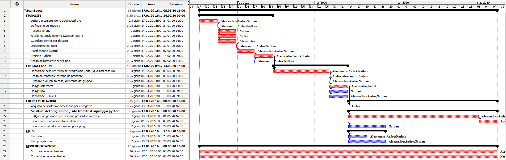

1. [Introduzione](#introduzione)

  - [Informazioni sul progetto](#informazioni-sul-progetto)

  - [Abstract](#abstract)

  - [Scopo](#scopo)

1. [Analisi](#analisi)

  - [Analisi del dominio](#analisi-del-dominio)

  - [Analisi dei mezzi](#analisi-dei-mezzi)

  - [Analisi e specifica dei requisiti](#analisi-e-specifica-dei-requisiti)

  - [Use case](#use-case)

  - [Pianificazione](#pianificazione)

1. [Progettazione](#progettazione)

  - [Design dell’architettura del sistema](#design-dell’architettura-del-sistema)

  - [Design dei dati e database](#design-dei-dati-e-database)

1. [Implementazione](#implementazione)

1. [Test](#test)

  - [Protocollo di test](#protocollo-di-test)

  - [Risultati test](#risultati-test)

  - [Mancanze/limitazioni conosciute](#mancanze/limitazioni-conosciute)

1. [Consuntivo](#consuntivo)

1. [Conclusioni](#conclusioni)

  - [Sviluppi futuri](#sviluppi-futuri)

  - [Considerazioni personali](#considerazioni-personali)

1. [Sitografia](#sitografia)

1. [Allegati](#allegati)

## Introduzione

### Informazioni sul progetto

  -   Allievi: Nathan Luè, André Da Silva, Alessandro Aloise

  -   Docenti coinvolti: Luca Muggiasca, Geo Petrini

  -   Modulo 306, SAM Trevano I3AC  

  -   Durata progetto: 17 gennaio 2020 - 08 maggio 2020

### Abstract

  Al giorno d'oggi è molto importante avere dei dati che permettono di capire quanto una cosa sia piaciuta alle persone che l'hanno vista. Questo progetto permette di avere un riscontro esaustivo sulla presenza delle persone ad uno stand. Grazie a grafici e dati precisi, il programma, permetterà di sapere quante persone hanno visitato lo stand, in che ora, qual è la fascia oraria con più visite e molto altro. Con questo semplice progetto non è più necessario utilizzare complicati ed obsoleti metodi, grazie a ScanSpect i dati sono nelle tue mani.

  >*Nowadays it is very important to have data that allow you to understand how much a person liked it. This project allows you to have an exhaustive feedback on the presence of people at a stand. Thanks to precise graphics and data, the program will allow you to know how many people visited the stand, at what time, what is the time slot with the most visits and much more. With this simple project it is no longer necessary to use complicated and obsolete methods, thanks to ScanSpect the data are in your hands.*

### Scopo

  Lo scopo di questo progetto didattico è quello di creare un sistema di monitoraggio del numero di persone che si presentano ad un ipotetico stand di una fiera. Il conteggio delle persone avviene tramite l'identificazione delle facce dei soggetti. Se la faccia identificata si muove rimanendo nella webcam viene contata solo una volta. Inoltre vi è la possibilità di visualizzare i dati del conteggio con diversi grafici.

## Analisi

### Analisi del dominio

  Questo capitolo dovrebbe descrivere il contesto in cui il prodotto verrà
  utilizzato, da questa analisi dovrebbero scaturire le risposte a quesiti
  quali ad esempio:

  -   Background/Situazione iniziale

  -   Quale è e come è organizzato il contesto in cui il prodotto dovrà
      funzionare?

  -   Come viene risolto attualmente il problema? Esiste già un prodotto
      simile?

  -   Chi sono gli utenti? Che bisogni hanno? Come e dove lavorano?

  -   Che competenze/conoscenze/cultura posseggono gli utenti in relazione
      con il problema?

  -   Esistono convenzioni/standard applicati nel dominio?

  -   Che conoscenze teoriche bisogna avere/acquisire per poter operare
      efficacemente nel dominio?

  -   …

  Questo prodotto sarà utilizzabile da chiunque abbia uno stand visitato da persone. Ciò permette all'utilizzatore di sapere quante persone, in che modo e in che periodo hanno visitato lo stand. Grazie alle innovative tecnologie utilizzate vi sarà la possibilità di utilizzare il servizio scaricando ed avviando unicamente un file eseguibile.
   
  Esistono alcuni software che permettono di rilevare la presenza negli stand, ma tutti sono molto complicati e molto costosi. Inoltre l'utilizzo dell'intelligenza artificiale rende questo progetto infinitamente più semplice da utilizzare rispetto a quelli presenti sul mercato.
   
  Chiunque può utilizzare il seguente prodotto, gli unici requisiti sono: avere un computer, un webserver locale ed un database. Grazie alle semplici interfaccie leggibili ed intuitive non servirà nessuna conoscenza informatica particolare per utilizzare il prodotto.

### Analisi e specifica dei requisiti

  Questa è la lista di requisiti discussi in classe con il profesore:

  |**ID**|**Nome**|**Descrizione**|**Priorità**|**Vers**|**Note**|
  |----|------------|--------|----|----------|------|
  |Req-01|Utilizzo di librerie esterne|Devono essere utilizzate delle librerie esterne per poter contare le facce delle persone.|1|1.0|...|
  |Req-02|Multipiattaforma|L'applicativo o il sito deve essere utilizzabile su qualsiasi piattaforma (Windows, Linux e MacOS).|1|1.0|...|
  |Req-03|Registrazione orario di visita|Deve essere registrato l'orario di visita di ogni persona che viene rilevata dalla webcam.|1|1.0|...|
  |Req-04|Salvataggio viso dell'utente non necessario|Non è necessario salvare il viso dell'utente, basta identificare una faccia generica.|1|1.0|...|
  |Req-05|Sito informativo|Deve essere presente un sito informativo consultabile da un utilizzatore del programma. Nel sito è presente una guida e la possibilità di scaricare il software.|1|1.0|...|
  |Req-06|Sezione accessibile all'amministratore|Deve essere presente una sezione accessibile solamente all'amministratore nella quale potrà accedere ai dati registrati ed alle configurazioni del sistema.|1|1.0|...|
  |Req-07|Conteggio persone| Se l'utente si move all'interno del campo della webcam, viene contato solo una volta.|1|1.0|...|
  |Req-08|Conteggio facce|Devono essere contati il numero di persone tramite la loro faccia (se è presente solo il busto o una parte di una persona, il contatore non aumenta).|1|1.0|...|
  |Req-09|Grafici ed analisi|Devono essere presenti dei grafici per analizzare i dati ricavati dalla webcam.|1|1.0|...|
  |Req-10|Riproduzione webcam a schermo|Il video della webcam e i dati analizzati dalla webcam devono essere riprodotti a schermo.|1|1.0|...|
  |Req-11|Presenza di interfaccia|Deve essere presente una Gui.|1|1.0|...|
  |Req-12|Composizione delle statistiche analizzate|Le statistiche dovranno visualizzare nel tempo la frequenza di passaggio allo stand, sia giornalmente che in determinate fasce orarie.|1|1.0|...|
  |Req-13|Comparazione con celebrità|Deve essere presente la possibilità di comparare la faccia di un utente con un dataset di facce di celebrità e ritornare quella più simile.|2|1.0|...|

**Spiegazione elementi tabella dei requisiti:**

**ID**: identificativo univoco del requisito

**Nome**: il nome del requisito

**Descrizione**: breve descrizione del requisitol

**Priorità**: l'importanza con la quale deve essere svolto un requisito

**Versione**: indica la versione del requisito. 

**Note**: eventuali osservazioni

### Use case

I casi d’uso rappresentano l’interazione tra i vari attori e le
funzionalità del prodotto.

### Pianificazione

Prima di stabilire una pianificazione bisogna avere almeno una vaga idea
del modello di sviluppo che si intende adottare. In questa sezione
bisognerà inserire il modello concettuale di sviluppo che si seguirà
durante il progetto. Gli elementi di riferimento per una buona
pianificazione derivano da una scomposizione top-down della problematica
del progetto.

La pianificazione può essere rappresentata mediante un diagramma di
Gantt.

Se si usano altri metodi di pianificazione (es scrum), dovranno apparire
in questo capitolo.

### Analisi dei mezzi

Elencare e *descrivere* i mezzi disponibili per la realizzazione del
progetto. Ricordarsi di sempre descrivere nel dettaglio le versioni e il
modello di riferimento.

SDK, librerie, tools utilizzati per la realizzazione del progetto e
eventuali dipendenze.

Su quale piattaforma dovrà essere eseguito il prodotto? Che hardware
particolare è coinvolto nel progetto? Che particolarità e limitazioni
presenta? Che hw sarà disponibile durante lo sviluppo?

Per realizzare questo progetto sono stati utilizzati i seguenti software:
<ul>
  <li>ProjectLibre - 1.9.1: Per la creazione del Gantt.</li>
  <li>Visual Studio Code - 1.43: Per tutto ciò che riguarda la scrittura del codice Python/Php/html/css/Javascript</li>
  <li>Python - 2.7: Per la creazione dell'applicativo principale</li>
  <li>OpenCV - 4.2.0: Libreria utilizzata per il riconoscimento facciale</li>
  <li>Database</li>
  <li>Webserver</li>
</ul>

L'applicativo è multipiattaforma (Windows, MacOS, Linux). Il progetto non necessa forze computazionali esagerate, necessita però di una WebCam (che sia integrata o esterna). Senza una WebCam l'applicativo non funzionerà.

## Progettazione

Questo capitolo descrive esaustivamente come deve essere realizzato il
prodotto fin nei suoi dettagli. Una buona progettazione permette
all’esecutore di evitare fraintendimenti e imprecisioni
nell’implementazione del prodotto.

### Design dell’architettura del sistema

Descrive:

-   La struttura del programma/sistema lo schema di rete...

-   Gli oggetti/moduli/componenti che lo compongono.

-   I flussi di informazione in ingresso ed in uscita e le
    relative elaborazioni. Può utilizzare *diagrammi di flusso dei
    dati* (DFD).

-   Eventuale sitemap

L'immagine indica il gantt stilato ad inizio progetto. Le due fasi che sulla carta impiegano più tempo sono l'implementazione e il test. Queste fasi sono  circa i 2/3 del tempo impiegato per portare a termine il progetto. Le attività sono divise per allievo, ogni tanto è possibile che più allievi lavorino insieme ed ogni tanto è possibile che un allievo lavori singolarmente. Questo è il gantt iniziale, potrebbe essere differente dal gantt consuntivo indicato nell'immagine sotto.

Gantt consuntivo ancora da fare.

L'immagine mostra lo schema della struttura del progetto. Il progetto è composto da un programma che rileva il numero di persone. Ad ogni rilevamento inserisce un dato all'interno del database (all'inizio lo crea se non esiste). La logica del sito (in php), si occupa di richiedere i dati al database e di mandarli al sito vero e prorpio. Così facendo il sito ha abbastanza valori per creare un'interfaccia con dei grafici esaustivi e stampare i dati in una tabella.

### Design dei dati e database

Descrizione delle strutture di dati utilizzate dal programma in base
agli attributi e le relazioni degli oggetti in uso.

### Schema E-R, schema logico e descrizione.

Se il diagramma E-R viene modificato, sulla doc dovrà apparire l’ultima
versione, mentre le vecchie saranno sui diari.

### Design delle interfacce

Descrizione delle interfacce interne ed esterne del sistema e
dell’interfaccia utente. La progettazione delle interfacce è basata
sulle informazioni ricavate durante la fase di analisi e realizzata
tramite mockups.

### Design procedurale

Descrive i concetti dettagliati dell’architettura/sviluppo utilizzando
ad esempio:

-   Diagrammi di flusso e Nassi.

-   Tabelle.

-   Classi e metodi.

-   Tabelle di routing

-   Diritti di accesso a condivisioni …

Questi documenti permetteranno di rappresentare i dettagli procedurali
per la realizzazione del prodotto.

## Implementazione

In questo capitolo dovrà essere mostrato come è stato realizzato il
lavoro. Questa parte può differenziarsi dalla progettazione in quanto il
risultato ottenuto non per forza può essere come era stato progettato.

Sulla base di queste informazioni il lavoro svolto dovrà essere
riproducibile.

In questa parte è richiesto l’inserimento di codice sorgente/print
screen di maschere solamente per quei passaggi particolarmente
significativi e/o critici.

Inoltre dovranno essere descritte eventuali varianti di soluzione o
scelte di prodotti con motivazione delle scelte.

Non deve apparire nessuna forma di guida d’uso di librerie o di
componenti utilizzati. Eventualmente questa va allegata.

Per eventuali dettagli si possono inserire riferimenti ai diari.

## Test

### Protocollo di test

Definire in modo accurato tutti i test che devono essere realizzati per
garantire l’adempimento delle richieste formulate nei requisiti. I test
fungono da garanzia di qualità del prodotto. Ogni test deve essere
ripetibile alle stesse condizioni.

|Test Case      | TC-001                               |
|---------------|--------------------------------------|
|**Nome**       |Import a card, but not shown with the GUI |
|**Riferimento**|REQ-012                               |
|**Descrizione**|Import a card with KIC, KID and KIK keys with no obfuscation, but not shown with the GUI |
|**Prerequisiti**|Store on local PC: Profile\_1.2.001.xml (appendix n\_n) and Cards\_1.2.001.txt (appendix n\_n) |
|**Procedura**     | - Go to “Cards manager” menu, in main page click “Import Profiles” link, Select the “1.2.001.xml” file, Import the Profile - Go to “Cards manager” menu, in main page click “Import Cards” link, Select the “1.2.001.txt” file, Delete the cards, Select the “1.2.001.txt” file, Import the cards |
|**Risultati attesi** |Keys visible in the DB (OtaCardKey) but not visible in the GUI (Card details) |

### Risultati test

Tabella riassuntiva in cui si inseriscono i test riusciti e non del
prodotto finale. Se un test non riesce e viene corretto l’errore, questo
dovrà risultare nel documento finale come riuscito (la procedura della
correzione apparirà nel diario), altrimenti dovrà essere descritto
l’errore con eventuali ipotesi di correzione.

### Mancanze/limitazioni conosciute

Descrizione con motivazione di eventuali elementi mancanti o non
completamente implementati, al di fuori dei test case. Non devono essere
riportati gli errori e i problemi riscontrati e poi risolti durante il
progetto.

## Consuntivo

Consuntivo del tempo di lavoro effettivo e considerazioni riguardo le
differenze rispetto alla pianificazione (cap 1.7) (ad esempio Gannt
consuntivo).

## Conclusioni

Quali sono le implicazioni della mia soluzione? Che impatto avrà?
Cambierà il mondo? È un successo importante? È solo un’aggiunta
marginale o è semplicemente servita per scoprire che questo percorso è
stato una perdita di tempo? I risultati ottenuti sono generali,
facilmente generalizzabili o sono specifici di un caso particolare? ecc

### Sviluppi futuri
  Migliorie o estensioni che possono essere sviluppate sul prodotto.

### Considerazioni personali
  Cosa ho imparato in questo progetto? ecc

## Bibliografia

### Bibliografia per articoli di riviste
1.  Cognome e nome (o iniziali) dell’autore o degli autori, o nome
    dell’organizzazione,

2.  Titolo dell’articolo (tra virgolette),

3.  Titolo della rivista (in italico),

4.  Anno e numero

5.  Pagina iniziale dell’articolo,

### Bibliografia per libri

1.  Cognome e nome (o iniziali) dell’autore o degli autori, o nome
    dell’organizzazione,

2.  Titolo del libro (in italico),

3.  ev. Numero di edizione,

4.  Nome dell’editore,

5.  Anno di pubblicazione,

6.  ISBN.

### Sitografia

1.  URL del sito (se troppo lungo solo dominio, evt completo nel
    diario),

2.  Eventuale titolo della pagina (in italico),

3.  Data di consultazione (GG-MM-AAAA).

**Esempio:**

-   http://standards.ieee.org/guides/style/section7.html, *IEEE
    Standards Style Manual*, 07-06-2008.

## Allegati

Elenco degli allegati, esempio:

-   Diari di lavoro

-   Codici sorgente/documentazione macchine virtuali

-   Istruzioni di installazione del prodotto (con credenziali
    di accesso) e/o di eventuali prodotti terzi

-   Documentazione di prodotti di terzi

-   Eventuali guide utente / Manuali di utilizzo

-   Mandato e/o Qdc

-   Prodotto

-   …
